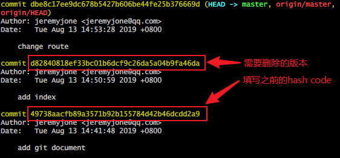
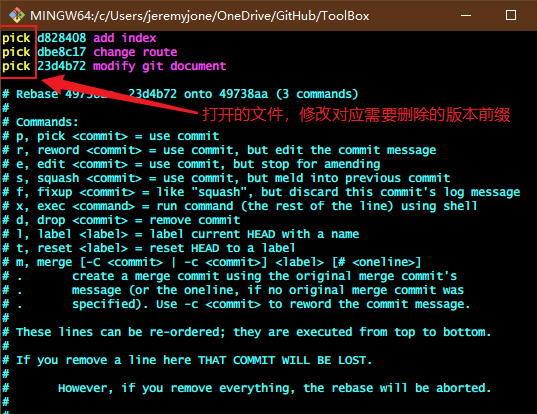

# GIT命令

## 安装

- ### Linux

  - Linux下

    ```shell
    sudo apt-get install git
    ```

  - 老一点的Debian或Ubuntu Linux，要把命令改为

    sudo apt-get install git-core

- ### Windows

  - 在Windows上使用Git，可以从Git官网直接[下载安装程序](https://git-scm.com/downloads)，（网速慢的同学请移步[国内镜像](https://pan.baidu.com/s/1kU5OCOB#list/path=%2Fpub%2Fgit)），然后按默认选项安装即可。安装完成后，在开始菜单里找到“Git”->“Git Bash”，蹦出一个类似命令行窗口的东西，就说明Git安装成功！

  

- ### Mac OS X

  - 一是安装homebrew，然后通过homebrew安装Git，具体方法请参考homebrew的文档：[http://brew.sh/](http://brew.sh/)。

  - 第二种方法更简单，也是推荐的方法，就是直接从AppStore安装Xcode，Xcode集成了Git，不过默认没有安装，你需要运行Xcode，选择菜单“Xcode”->“Preferences”，在弹出窗口中找到“Downloads”，选择“Command Line Tools”，点“Install”就可以完成安装了。

安装完成后，可以在shell或bash中查看git

  ```shell
  git --version
  ```

显示当前安装的git版本信息，说明已经安装成功了。

## 配置

- 提交名字

    ```shell
    git config --global user.name "yourname"
    ```

- 提交邮箱

    ```shell
    git config --global user.email "yourname@example.com"
    ```

- 创建SSH

    ```shell
    ssh-keygen -t rsa -C "youremail@example.com"
    ```

- 将新生成的SSH全部拷贝并添加到远程仓库的相应设置中。

## 本地使用

### - 提交

- 初始化本地仓库

    ```shell
    git init
    ```

- 检查多余的空白字符

    ```shell
    git diff --check
    ```

- 将文件放入暂存区

  - 存放指定文件

    ```shell
    git add filename
    ```

  - 将文件的修改、新建添加到暂存区

    ```shell
    git add . //注意add后面是一个点,你没看错
    ```

  - 将文件的修改、删除添加到暂存区

    ```shell
    git add -u
    ```

  - 将文件的修改、删除和新建添加到暂存区

    ```shell
    git add -A
    ```

- 查看文件修改与提交情况

    ```shell
    git status
    ```

- 将修改提交版本库

    ```shell
    git commit -m "desc"
    ```

    ```shell
    // 多行desc
    // 这里需要先暂时输入一个单引号，然后写多行信息，写完之后再输入下一个单引号
    git commit -m '
    1. log1
    2. log2
    3. log3
    '
    ```

- 重新提交

    ```shell
    git commit --amend -m "desc"
    ```

- 撤销对工作区文件的修改，若修改后没有放到暂存区，则与上个版本一致，若修改后放到暂存区，则和暂存区一致。

    ```shell
    git checkout -- filename
    ```

- 取消暂存区的指定文件

    ```shell
    git reset HEAD filename
    ```

- 删除本地文件，不再纳入版本管理

    ```shell
    git rm filename
    ```

- 不纳入版本管理，但本地不删除文件

    ```shell
    git rm --cached filename
    ```

- 查看提交日志

    ```shell
    git log  // 从近到远显示提交日志
    ```

    ```shell
    git log --pretty=oneline  // 将每个提交记录放在一行显示，其它参数：oneline、short、full、fuller等
    ```

- 删除某个提交

    ```shell
    git log  // 获取提交信息
    git rebase -i (commit-id)  // commit-id 为提交版本的hash code
    ```

    **注意：** 这里有个坑，commit-id是需要删除的前一个hash code，用图说明：

    

    使用命令后，打开一个文件，将需要删除版本前面的pick改为drop，用图说明：

    

    修改后保存关闭，`ZZ` 或者 `:wq`，vim的命令这里不赘述。

    退出后使用`git log`再次查看，可以看到对应版本已经没有了。

### - 回退

- 记录回退的命令

    ```shell
    git reflog
    ```

- 回退到上一版本

    ```shell
    git reset --hard HEAD
    ```

- 回退到指定版本

    ```shell
    git reset --hard 哈希值  // 哈希值可以使用reflog命令查看
    ```

### - 分支

- 查看分支

    ```shell
    git branch
    ```

- 创建分支

    ```shell
    git branch branchname
    ```

- 切换分支

    ```shell
    git checkout branchname
    git checkout -b branchname  // 创建并切换到该分支
    git checkout -f branchname  // 强制切换到该分支
    ```

- 删除分支

    ```shell
    git branch -D branchname
    ```

- 合并分支

    ```shell
    git merge branchname
    ```

- 查看合并记录

    ```shell
    git log --graph --pretty=oneline --abbrev-commit  // 查看分支合并情况
    git branch --merged  // 查看已合并到当前分支的分支、上游分支
    git branch --no-merged  // 查看尚未合并的分支
    ```

### - 操作git中的文件

- 查看git占用空间

    ```shell
    du -sh
    ```

- 查找git中的文件

    ```shell
    git verify-pack -v .git/objects/pack/pack-*.idx | sort -k 3 -g | tail -5  // 找出git中占空间最大的前5个文件的id

    git rev-list --objects --all | grep .  // 查看文件列表，可以和grep一起使用，grep后跟需要查找的文件名或id
    ```

- 删除匹配的*.rar文件

    ```shell
    git filter-branch --force --index-filter 'git rm --cached --ignore-unmatch *.rar' --prune-empty --tag-name-filter cat -- --all
    ```

- 回收空间

    ```shell
    rm -rm .git/refs/original
    git reflog expire --expire=now --all
    git gc --prune=now
    git gc --aggressive --prune=now
    ```

### - 比较

- 比较工作区与暂存区的差异

    ```shell
    git diff
    ```

- 比较工作区与当前分支库的差异

    ```shell
    git diff HEAD
    git diff HEAD -- path  // 与当前分支库同一目录比较
    ```

- 比较暂存区与版本库的差异

    ```shell
    git diff --cached (或 --staged)
    ```

- 比较不同版本库中不同文件的差异

    ```shell
    git diff HEAD:filename HEAD:filename
    ```

- 查看每次提交差异

    ```shell
    git log -p -2  // 查询每次提交的行差异， 2查询的是提交次数，-p是展开显示每次提交的内容差异
    git log -U1 --word-diff  // 查询每次提交的单词差异
    git log --stat  // 显示改动的概要信息
    ```

### - 标签

- 查看标签

    ```shell
    git tag
    ```

- 创建标签

    ```shell
    git tag content  // content填写标签内容
    ```

- 删除本地标签

    ```shell
    git tag -d content
    ```

- 发布标签

    ```shell
    git push -u origin content
    ```

- 删除远程标签

    ```shell
    git push origin --delete tag content
    ```

## 远程操作

- 查看仓库信息

    ```shell
    git remote
    ```

- 克隆远程仓库到本地

    ```shell
    git clone [url]  // [url]从远程仓库获取
    ```

- 添加远程仓库

    ```shell
    git remote add [name] [url]
    ```

- 将远程仓库分支添加到本地

    ```shell
    git fetch origin mbranchname
    ```

- 更新分支

    ```shell
    git pull  // 更新当前分支
    git pull branchname master  // 获取并合并远程分支到本地master分支
    git pull origin branchname  // 将远程仓库分支拉取到本地
    ```

- 推送分支

    ```shell
    git push  // 向远程仓库推送当前分支
    git push -f ...  // 强制推送
    git push branchname master  // 向远程仓库推送master分支
    git push origin branchname  // 将本地仓库提交到远程仓库
    git push -u origin branchname  // 第一次推送时需要 -u 参数
    ```

- 合并分支

    ```shell
    git merge fork  // 将fork分支合并到当前分支
    git checkout fork a.c b.c  // 将fork分支的a.c b.c文件强制覆盖当前分支的对应文件
    git merge origin branchname  // 将本地分支与远程分支合并
    git mergetool  // 使用工具比较查看冲突
    ```

- 将最近两次提交合并为一个提交，并强制提交到远程仓库

    ```shell
    git reset --soft HEAD
    git commit -m "..."
    git push --force
    ```

- *实例*

    <font color="#0E6DB0">将共享库添加到自己的仓库并拉到本地</font>

    ```shell
    git remote add gitignore https://github.com/github/gitignore
    git pull origin gitignore
    ```
